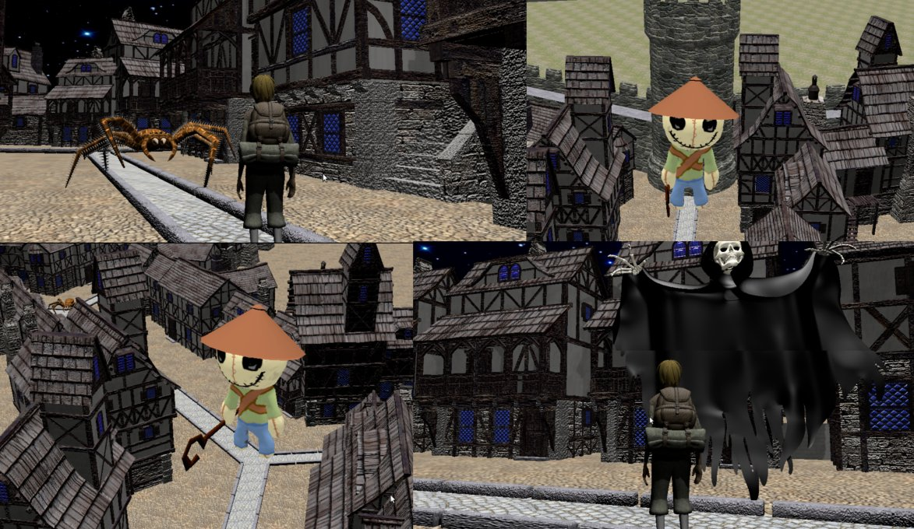

# Medieval CityGen
An automatic generator for medieval scenes and games


<https://github.com/jmespadero/cityGen>

## Description
Medieval CityGen is a set of tools to automatically generate random 2D 
maps of medieval cities, which are then converted into 3D scenes
and videogames.

The scripts are mainly written in [python3](https://www.python.org), 
models are generated with [blender3D](https://www.blender.org) and
games are playable using blenderplayer.

## Contributors
Medieval CityGen development started in 2014 as the CS grade final project of Juan Ramos
under the supervision of [Jose M. Espadero](https://github.com/jmespadero).
Its work is currently being continued by [Sergio Fernandez](https://github.com/sergiofv93).

Most of the artwork has been done by external artists that have released
their work under open licenses. Please refer to the Readme.txt file
bundled inside of each .blend file to get detailed info about their authors 
and licenses applyed to their work. If you feel that you are owner of any 
artwork used here, send me a message to be acknowledged or ask to remove your work.

Special thanks to [Daniel Andersson](http://www.blendswap.com/user/Daniel74)
and [Dennis Haupt](http://traevaine.com/) for their 3D artworks.

## Getting Started (How do I play?)

### Prerequisites
You just need to have [blender3D](https://www.blender.org) installed in your computer.
If you plain to tweak the procedure to build the 2D map, then it is recommended to have the
[matplotlib](https://matplotlib.org/) package installed to generate svg images with the step-by-step construction 
of the 2D map. Matplotlib is *not* included into the python interpreter bundled with 
blender, so it is recommendable install your own python interpreter.

### Installing
Just clone or download a copy of this repository:
``` sh
    git clone https://github.com/jmespadero/cityGen.git
    cd cityGen
```
If you are really anxious to test it, just try the files in the [demos](demos) directory, but 
keep in mind that they do not represent current status of the project .
``` sh
    cd demos
    blenderplayer demo1game.blend
```

### Creating a new random 3D model and game
To create a new 2D map and 3D model from scratch, execute the command:
``` sh
    blender --background --python cityGen2D.py --python cityGen3D.py
```

As alternative, you can run the 2D script and 3D script separated, so you can 
change the configuration file and create several 3D models from the same 2 map.
``` sh
    python3 cityGen2D.py 
    blender --background --python cityGen3D.py
```

You can use some parameter to control values as city size and initial random seed
(so you create the same 2D map several times)
* python3 cityGen2D.py  --randomSeed 10
* python3 cityGen2D.py -s 30 --randomSeed 47932

### Executing a game
Just open the cityGame.blend file with blender or blenderplayer programs.

## License
This project is build as a mash-up of many works (3D artwork, music and even code) previously 
published under a range of open licenses. We will honor each of these licenses for each 
contribution. Please see the Readme.txt file inside of each .blend file to get details about the 
real author, source URL and license applied to its work.

The python code written for this project is published under 
[Creative Commons BY-NC-SA 3.0 license](https://creativecommons.org/licenses/by-nc-sa/3.0/).

